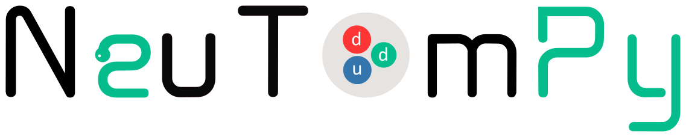

Welcome to NeuTomPy toolbox's documentation!
============================================

**NeuTomPy toolbox** is a Python package for tomographic data processing and reconstruction.
The toolbox includes pre-processing algorithms, artifacts removal and a wide range of iterative
reconstruction methods as well as the Filtered Back Projection algorithm.
The NeuTomPy toolbox was conceived primarily for Neutron Tomography and developed to support
the need of users and researchers to compare state-of-the-art reconstruction methods and choose the optimal data-processing
workflow for their data.

Features
========
* Readers and writers for TIFF and FITS files and stack of images
* Data normalization with dose correction, correction of the rotation axis tilt, ring-filters, outlier removals, beam-hardening correction
* A wide range of reconstruction algorithms powered by `ASTRA toolbox <https://www.astra-toolbox.com/>`_ : FBP, SIRT, SART, ART, CGLS, NN-FBP, MR-FBP
* Image quality assessment with several metrics

Reference
=========
If you use the NeuTomPy toolbox for your research, please cite the following paper:

* D\. Micieli, T. Minniti, G. Gorini, "NeuTomPy toolbox, a Python package for tomographic data processing and reconstruction", SoftwareX, Volume 9 (2019), pp. 260-264, https://doi.org/10.1016/j.softx.2019.01.005.

Table of Contents
=================

.. toctree::
   :maxdepth: 1

   installation
   examples
   api

Indices and tables
==================

* :ref:`genindex`
* :ref:`modindex`
* :ref:`search`
